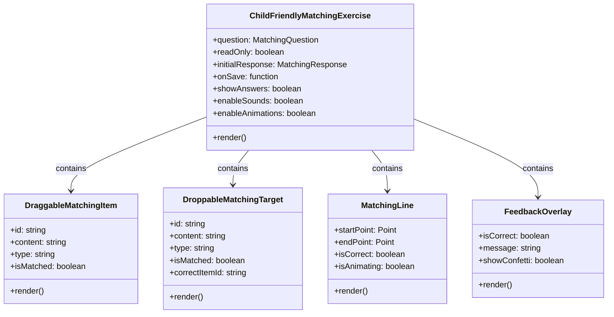
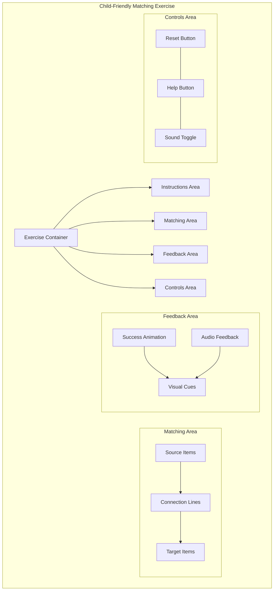

# Child-Friendly Matching Exercise UI/UX Improvement Plan

## Overview

This document outlines the plan for improving the UI/UX design of the matching exercise component to make it more intuitive and child-friendly for preschool children (3-5 years old). The improved design will feature side-by-side visual layout, drag-and-drop interaction, enhanced visual cues, simplified language, and immediate feedback.

## Current Implementation Analysis

The current matching exercise has two main implementations:
1. `matching-exercise.tsx` - Uses a two-column layout with click-based matching
2. `simplified-matching-exercise.tsx` - Also uses a two-column layout with better visual feedback

Both implementations have limitations for preschool children:
- No visual connections between matched items
- The matching process isn't intuitive enough for young children
- Limited visual feedback and animations
- Interface language isn't simplified for preschool level

## Proposed Solution Overview

We will create an enhanced `child-friendly-matching-exercise.tsx` component with these key improvements:

1. **Side-by-side visual layout**:
   - All items displayed in a single, unified space
   - Clear visual connections between matching items
   - Larger, more spaced-out elements for easier interaction

2. **True drag-and-drop interaction**:
   - Direct dragging of items to their matches
   - Items snap into place when correctly matched
   - Large touch targets for developing motor skills

3. **Enhanced visual cues**:
   - Animated connecting lines between matched items
   - Color-coded items and matches
   - Visual highlighting of potential matches
   - Animated success indicators

4. **Simplified language and instructions**:
   - Minimal text, more visual instructions
   - Audio instructions for non-readers
   - Simple icons to convey actions

5. **Immediate feedback**:
   - Instant visual and audio feedback on matches
   - Celebratory animations for correct matches
   - Gentle guidance for incorrect attempts

## Technical Architecture



## UI Layout Design



## Implementation Plan

### Phase 1: Core Component Structure

1. Create a new `child-friendly-matching-exercise.tsx` component
2. Set up the basic component structure with props interface
3. Implement the drag-and-drop functionality using dnd-kit
4. Create the basic layout with source and target areas

### Phase 2: Visual Connections and Feedback

1. Implement the visual connection lines between matched items
2. Add animations for dragging, matching, and success states
3. Implement color coding and visual cues
4. Add sound effects for different interactions

### Phase 3: Child-Friendly Enhancements

1. Simplify the UI language and add visual instructions
2. Implement audio instructions and feedback
3. Add celebratory animations for successful matches
4. Optimize touch targets and interaction areas for small hands

### Phase 4: Testing and Refinement

1. Test with different types of matching content (images, text, numbers)
2. Optimize for accessibility and ease of use
3. Refine animations and timing for best user experience
4. Ensure compatibility with different screen sizes

## Detailed Component Implementation

### ChildFriendlyMatchingExercise Component

```typescript
interface ChildFriendlyMatchingExerciseProps {
  question: {
    id: string;
    questionText: string;
    questionData: MatchingQuestion;
  };
  readOnly?: boolean;
  initialResponse?: MatchingResponse;
  onSave?: (response: MatchingResponse) => void;
  showAnswers?: boolean;
  enableSounds?: boolean;
  enableAnimations?: boolean;
}
```

The main component will:
1. Manage the state of matched and unmatched items
2. Handle drag-and-drop interactions
3. Render the visual connections between items
4. Provide immediate feedback on matches
5. Play appropriate sound effects
6. Show celebratory animations for success

### Key Features in Detail

#### 1. Side-by-Side Visual Layout

- Items will be displayed in a grid or flexible layout
- Source items on the left, target items on the right
- Clear visual separation but with enough proximity to see relationships
- Large, touch-friendly item sizes with adequate spacing

#### 2. Drag-and-Drop Interaction

- Direct dragging from source to target
- Visual feedback during dragging (item follows cursor/finger)
- Items snap into place when correctly matched
- Gentle bounce-back animation for incorrect matches
- "Picking up" and "placing" sound effects

#### 3. Visual Cues

- Animated connecting lines between matched items
- Color-coded items and targets (matching pairs share colors)
- Subtle highlighting of potential matches when dragging
- Clear success indicators (stars, checkmarks, etc.)
- Visual hints that activate after a period of inactivity

#### 4. Simplified Language

- Replace text instructions with visual demonstrations
- Use universal icons and symbols where possible
- Add audio narration for instructions
- Simple, encouraging messages for feedback

#### 5. Immediate Feedback

- Visual feedback directly on the matched items
- Sound effects for correct/incorrect matches
- Animated reactions (bouncing, glowing, etc.)
- Confetti or star burst animations for completed exercises

## Technical Implementation Details

### Using dnd-kit for Enhanced Drag and Drop

We'll use the dnd-kit library but extend it with custom sensors and modifiers to make it more child-friendly:

```typescript
// Custom sensor for easier activation with less precision required
const childFriendlySensor = useSensor(PointerSensor, {
  activationConstraint: {
    distance: 5, // Reduced distance needed to start dragging
    delay: 100, // Shorter delay for more immediate response
    tolerance: 10, // More tolerance for imprecise movements
  },
});

// Custom collision detection that's more forgiving
const childFriendlyCollisionDetection = (args) => {
  // Implement a more forgiving collision detection algorithm
  // that allows for near-matches to be considered valid
  // This helps children with developing motor skills
};
```

### Drawing Connection Lines

We'll implement a custom SVG-based line drawing system to connect matched items:

```typescript
const MatchingLine = ({ startPoint, endPoint, isCorrect, isAnimating }) => {
  return (
    <svg className="absolute inset-0 pointer-events-none z-10">
      <line
        x1={startPoint.x}
        y1={startPoint.y}
        x2={endPoint.x}
        y2={endPoint.y}
        stroke={isCorrect ? "#4CAF50" : "#FF9800"}
        strokeWidth={3}
        strokeDasharray={isAnimating ? "5,5" : "none"}
        className={isAnimating ? "animate-dash" : ""}
      />
    </svg>
  );
};
```

### Audio Feedback System

We'll enhance the existing sound system to provide more immediate and varied feedback:

```typescript
const playMatchSound = (isCorrect: boolean) => {
  if (isCorrect) {
    // Play a cheerful, rewarding sound
    playSound('correct', 0.7);
    
    // Follow up with encouraging voice if all matches are complete
    if (allMatchesComplete) {
      setTimeout(() => playSound('great-job'), 500);
    }
  } else {
    // Play a gentle, non-discouraging sound
    playSound('try-again', 0.5);
  }
};
```

### Animations for Engagement

We'll use Framer Motion for smooth, engaging animations:

```typescript
<motion.div
  initial={{ scale: 0.8, opacity: 0 }}
  animate={{ scale: 1, opacity: 1 }}
  exit={{ scale: 0.8, opacity: 0 }}
  whileHover={{ scale: 1.05 }}
  whileTap={{ scale: 0.95 }}
  transition={{ type: "spring", stiffness: 300, damping: 15 }}
  className="matching-item"
>
  {/* Item content */}
</motion.div>
```

## Accessibility Considerations

For preschool children, we need to ensure:

1. **Large touch targets**: All interactive elements will be at least 44x44px
2. **High contrast**: Clear visual distinction between elements
3. **Color independence**: Not relying solely on color for matching cues
4. **Audio alternatives**: Sound effects and voice instructions
5. **Simplified interactions**: Reducing complexity for developing cognitive abilities

## Mobile and Tablet Optimization

Since many preschool children use tablets:

1. **Touch optimization**: All interactions designed for touch first
2. **Landscape orientation support**: Optimal layout for wider screens
3. **Responsive sizing**: Elements scale appropriately for different devices
4. **Offline support**: Exercises work without constant internet connection

## Testing Strategy

1. **User testing with target age group**: Observe preschool children using the interface
2. **A/B testing of different visual cues**: Determine most effective feedback methods
3. **Performance testing on lower-end devices**: Ensure smooth animations
4. **Accessibility testing**: Verify usability for children with different abilities

## Handling Different Content Types

The matching exercise will support various content types:

1. **Images**: 
   - Larger display size
   - High contrast and vibrant colors
   - Simple, recognizable illustrations

2. **Text**:
   - Large, clear font (Comic Sans or similar child-friendly font)
   - Short words for beginning readers
   - Optional audio pronunciation on hover/tap

3. **Numbers**:
   - Large, bold display
   - Visual representation alongside numeral (e.g., dots)
   - Color coding for easier recognition

4. **Shapes**:
   - Bold outlines
   - Filled with distinct colors
   - Consistent sizing across different shapes