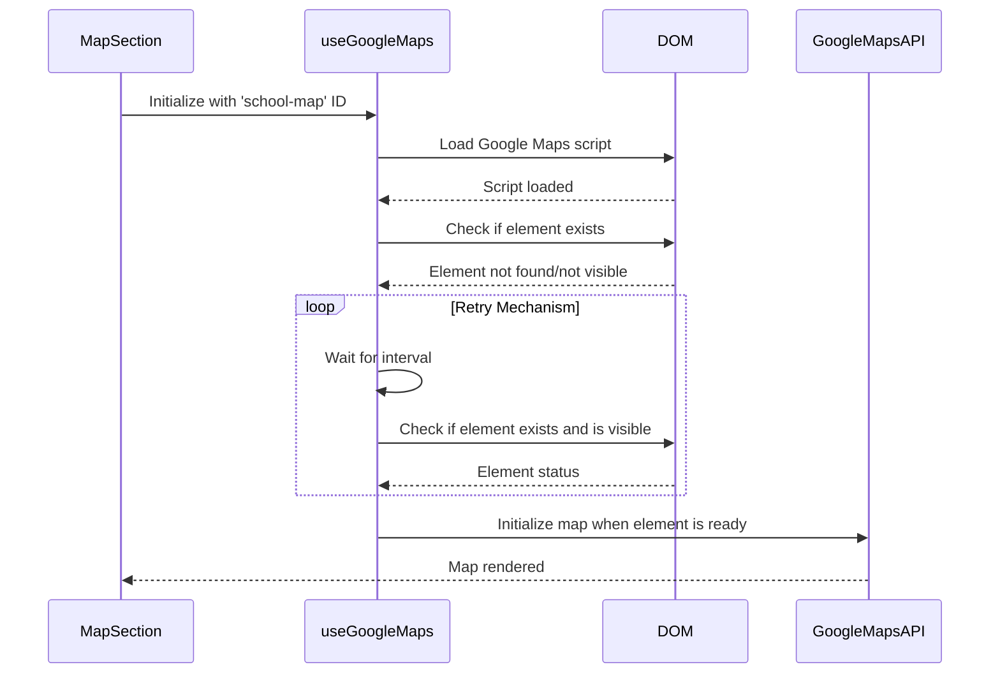

# Google Maps Container Fix Plan

## Problem Summary
The Google Maps container is not working with the error "Failed to load map: Map container element not found". This occurs because the map initialization is happening before the container element is properly accessible in the DOM due to animation effects.

## Solution Overview
We'll modify the `useGoogleMaps` hook to include a retry mechanism that checks for element visibility before initializing the map.



## Implementation Steps

### 1. Modify the useGoogleMaps Hook

We'll update the hook to:
- Add a retry mechanism with configurable parameters
- Check both for element existence AND visibility
- Provide better error messages
- Add timeout to prevent infinite retries

Here's the detailed implementation plan:

1. Add new state variables to track retry attempts and status
2. Create a function to check element visibility
3. Implement a retry mechanism using setTimeout
4. Update the error handling with more specific messages
5. Add proper cleanup to prevent memory leaks

### 2. Code Changes

Here's the specific code changes we'll make to `src/hooks/useGoogleMaps.ts`:

```typescript
import { useEffect, useState, useCallback } from 'react';
import { getSchoolLocation } from '@/services/googleMapsService';
import { SCHOOL_INFO } from '@/constants/schoolInfo';

interface UseGoogleMapsReturn {
  isLoading: boolean;
  error: Error | null;
}

interface UseGoogleMapsOptions {
  maxRetries?: number;
  retryInterval?: number;
  timeout?: number;
}

export function useGoogleMaps(
  mapElementId: string, 
  options: UseGoogleMapsOptions = {}
): UseGoogleMapsReturn {
  const [isLoading, setIsLoading] = useState(true);
  const [error, setError] = useState<Error | null>(null);
  const [retryCount, setRetryCount] = useState(0);
  
  const {
    maxRetries = 10,
    retryInterval = 300,
    timeout = 10000
  } = options;

  // Function to check if element exists and is visible
  const isElementReady = useCallback((elementId: string): boolean => {
    const element = document.getElementById(elementId);
    if (!element) return false;
    
    // Check if element is visible (has dimensions and is not hidden)
    const rect = element.getBoundingClientRect();
    const style = window.getComputedStyle(element);
    
    return (
      rect.width > 0 && 
      rect.height > 0 && 
      style.display !== 'none' && 
      style.visibility !== 'hidden' &&
      style.opacity !== '0'
    );
  }, []);

  // Initialize map when element is ready
  const initMap = useCallback(() => {
    try {
      if (!window.google?.maps) {
        throw new Error('Google Maps not loaded');
      }

      if (!isElementReady(mapElementId)) {
        throw new Error('Map container element not found or not visible');
      }

      const mapElement = document.getElementById(mapElementId);
      const location = getSchoolLocation();
      const map = new window.google.maps.Map(mapElement!, {
        center: location,
        zoom: 15,
      });

      new window.google.maps.Marker({
        position: location,
        map: map,
        title: SCHOOL_INFO.name,
      });

      setError(null);
      setIsLoading(false);
    } catch (err) {
      // If we haven't exceeded max retries, we'll try again
      if (retryCount < maxRetries) {
        setRetryCount(prev => prev + 1);
        return false; // Return false to indicate initialization failed
      }
      
      // Max retries exceeded, set error
      setError(err instanceof Error ? err : new Error('Error initializing map'));
      setIsLoading(false);
      return true; // Return true to indicate we're done trying
    }
    return true; // Return true to indicate successful initialization
  }, [mapElementId, retryCount, maxRetries, isElementReady]);

  useEffect(() => {
    let scriptLoaded = false;
    let timeoutId: number | undefined;
    let retryTimeoutId: number | undefined;
    
    const loadGoogleMapsScript = () => {
      try {
        const apiKey = import.meta.env.VITE_GOOGLE_MAPS_API_KEY;
        
        if (!apiKey) {
          throw new Error('Google Maps API key is not set in environment variables');
        }

        const script = document.createElement('script');
        script.src = `https://maps.googleapis.com/maps/api/js?key=${apiKey}`;
        script.async = true;
        script.onerror = () => {
          setError(new Error('Failed to load Google Maps script'));
          setIsLoading(false);
        };
        script.onload = () => {
          scriptLoaded = true;
          attemptInitialization();
        };
        document.body.appendChild(script);
      } catch (err) {
        setError(err instanceof Error ? err : new Error('Error loading Google Maps'));
        setIsLoading(false);
      }
    };

    // Function to attempt map initialization with retries
    const attemptInitialization = () => {
      if (!scriptLoaded) return;
      
      const initialized = initMap();
      
      if (!initialized && retryCount < maxRetries) {
        // Schedule next retry
        retryTimeoutId = window.setTimeout(attemptInitialization, retryInterval);
      }
    };

    loadGoogleMapsScript();
    
    // Set a timeout to prevent infinite retries
    timeoutId = window.setTimeout(() => {
      if (isLoading) {
        setError(new Error(`Map initialization timed out after ${timeout}ms`));
        setIsLoading(false);
      }
    }, timeout);

    // Cleanup
    return () => {
      if (timeoutId) window.clearTimeout(timeoutId);
      if (retryTimeoutId) window.clearTimeout(retryTimeoutId);
      
      const script = document.querySelector(
        'script[src*="maps.googleapis.com/maps/api/js"]'
      );
      if (script) {
        document.body.removeChild(script);
      }
    };
  }, [mapElementId, initMap, retryCount, maxRetries, retryInterval, timeout, isLoading]);

  return { isLoading, error };
}

// Add type definition for window.google
declare global {
  interface Window {
    google: any;
  }
}
```

### 3. Testing Plan

1. Test the map initialization with different scroll positions
2. Verify the map loads correctly when scrolled into view
3. Check error handling when the API key is missing or invalid
4. Test with different retry configurations to find optimal settings

## Benefits of This Approach

1. **Robustness**: The retry mechanism ensures the map initializes even with animation delays
2. **Maintainability**: Clear error messages make debugging easier
3. **User Experience**: Preserves the animation effects while ensuring the map loads correctly
4. **Flexibility**: Configurable options allow fine-tuning for different scenarios

## Potential Challenges

1. **Timing Issues**: Finding the right balance for retry intervals
2. **Performance**: Ensuring the retry mechanism doesn't impact page performance
3. **Browser Compatibility**: Ensuring visibility detection works across browsers

## Next Steps

1. Implement the changes to the useGoogleMaps hook
2. Test thoroughly in different browsers and scroll scenarios
3. Consider adding a loading indicator specific to the map component
4. Document the solution for future reference