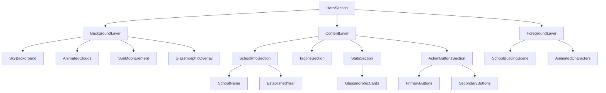

# HeroSection UI/UX Improvement Plan

## Overview
This document outlines the plan for enhancing the HeroSection component with modern design elements, better responsiveness, more engaging animations, and glassmorphism effects with layered depth.

## 1. Design Improvements

### 1.1 Glassmorphism Implementation
- Add frosted glass effect to key UI elements (stat cards, action buttons, tagline container)
- Implement backdrop-filter with blur effects
- Add subtle border gradients to glass elements
- Create depth with layered transparency levels

### 1.2 Modern Design Elements
- Update typography with variable font weights for more dynamic text presentation
- Implement more sophisticated color gradients that respond to theme changes
- Add subtle grain texture to backgrounds for added depth
- Enhance the visual hierarchy with improved spacing and sizing

### 1.3 Visual Depth Enhancements
- Implement subtle parallax scrolling effects for background elements
- Create layered card designs with proper shadow work
- Use z-index strategically to create a sense of depth
- Add subtle hover state transformations to interactive elements

## 2. Responsiveness Improvements

### 2.1 Mobile-First Approach
- Restructure layout to stack elements vertically on smaller screens
- Adjust font sizes and spacing for better readability on mobile
- Ensure touch targets are appropriately sized (minimum 44x44px)

### 2.2 Adaptive Layout
- Implement more sophisticated breakpoints for different device sizes
- Create custom layouts for different screen orientations
- Optimize animations for mobile performance

### 2.3 Performance Optimization
- Implement conditional rendering for heavy animations on mobile
- Optimize SVG animations for better performance
- Use will-change CSS property strategically for smoother animations

## 3. Animation Enhancements

### 3.1 Micro-interactions
- Add subtle hover animations to all interactive elements
- Implement scroll-triggered animations for elements as they enter the viewport
- Create smooth transitions between states (loading, hover, active)

### 3.2 Advanced Animation Techniques
- Implement spring physics for more natural motion
- Create coordinated animation sequences that tell a visual story
- Add mouse-position reactive elements for an interactive feel

### 3.3 Theme Transition Enhancement
- Create smoother transitions between light and dark modes
- Add animated elements that respond to theme changes
- Implement animated gradient backgrounds that shift with theme

## 4. Implementation Approach

### 4.1 Component Structure Updates



### 4.2 New Custom Components
- Create a `GlassmorphicCard` component for reusable glass effect elements
- Develop a `ParallaxLayer` component for depth effects
- Implement a `ResponsiveContainer` component for better mobile adaptation

### 4.3 CSS Enhancements
- Utilize CSS variables for theme-aware styling
- Implement advanced CSS features like backdrop-filter, mask-image
- Use CSS Grid for more flexible layouts
- Add container queries for component-level responsiveness

## 5. Technical Implementation Details

### 5.1 Glassmorphism Implementation
```typescript
// Example of glassmorphic card styling
const glassCardStyles = {
  background: "rgba(255, 255, 255, 0.1)",
  backdropFilter: "blur(10px)",
  border: "1px solid rgba(255, 255, 255, 0.2)",
  borderRadius: "16px",
  boxShadow: "0 4px 30px rgba(0, 0, 0, 0.1)",
  padding: "20px",
  transition: "all 0.3s ease"
};

// Dark mode variant
const darkGlassCardStyles = {
  background: "rgba(30, 30, 30, 0.2)",
  backdropFilter: "blur(10px)",
  border: "1px solid rgba(255, 255, 255, 0.1)",
  // Other properties remain the same
};
```

### 5.2 Responsive Layout Implementation
```tsx
// Example of responsive container with breakpoints
<div className={cn(
  "container mx-auto px-4",
  "flex flex-col md:flex-row",
  "gap-4 md:gap-8",
  "items-center justify-center"
)}>
  {/* Content */}
</div>
```

### 5.3 Enhanced Animation Implementation
```tsx
// Example of scroll-triggered animation with Framer Motion
const scrollAnimation = {
  hidden: { opacity: 0, y: 50 },
  visible: { 
    opacity: 1, 
    y: 0,
    transition: { 
      type: "spring", 
      stiffness: 100, 
      damping: 15 
    }
  }
};

// Usage
<motion.div
  initial="hidden"
  whileInView="visible"
  viewport={{ once: true, amount: 0.3 }}
  variants={scrollAnimation}
>
  {/* Content */}
</motion.div>
```

## 6. Implementation Phases

### Phase 1: Component Structure Refactoring
- Restructure the HeroSection into logical layers
- Create new custom components for glassmorphism effects
- Set up responsive layout framework

### Phase 2: Design Implementation
- Implement glassmorphic styling
- Update color schemes and gradients
- Enhance typography and visual hierarchy

### Phase 3: Animation Enhancements
- Implement improved micro-interactions
- Add scroll-triggered animations
- Create coordinated animation sequences

### Phase 4: Responsive Optimization
- Test and optimize for various screen sizes
- Implement performance optimizations for mobile
- Fine-tune touch interactions

### Phase 5: Testing and Refinement
- Cross-browser testing
- Performance testing
- Accessibility testing

## 7. Key Improvements Summary

1. **Visual Appeal**:
   - Glassmorphic UI elements with subtle blur effects
   - Layered design with proper depth cues
   - Enhanced color gradients and typography

2. **Responsiveness**:
   - Mobile-first approach with adaptive layouts
   - Optimized animations for mobile devices
   - Better touch interactions

3. **Animation Enhancements**:
   - More natural animations with spring physics
   - Scroll-triggered animations for better engagement
   - Interactive elements that respond to user actions

4. **Technical Improvements**:
   - Better component structure for maintainability
   - Performance optimizations for smoother experience
   - Enhanced theme transitions