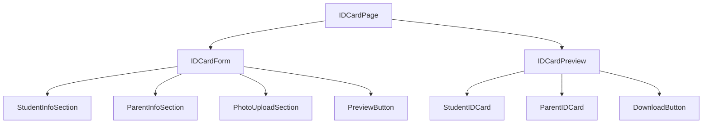
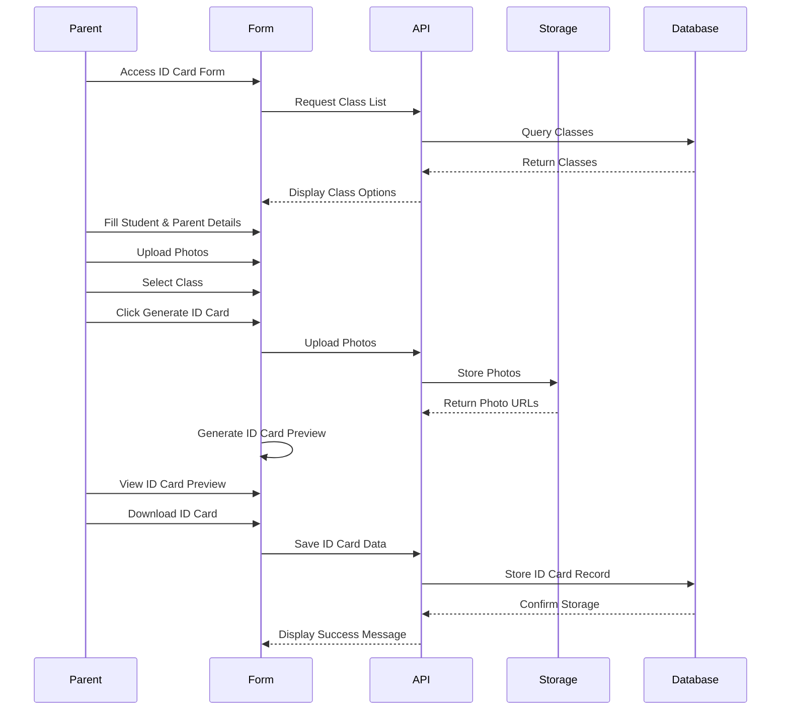

# ID Card Generation Feature - Implementation Plan

## Overview

We'll create a standalone page that allows parents to fill out a form with their child's details, upload photos, and generate an ID card immediately for download. The page will be accessible without login, and the ID card will have two pages: one for the student and one for the parents.

## Data Model

We'll need to create a new data model for the ID card information:

```typescript
interface IDCardData {
  // Student Information
  studentName: string;
  classId: string;
  className?: string;
  section?: string;
  admissionNumber?: string;
  studentPhoto: File | string;
  
  // Parent Information
  fatherName: string;
  motherName: string;
  fatherPhoto: File | string;
  motherPhoto: File | string;
  fatherMobile: string;
  motherMobile: string;
  address: string;
  
  // Metadata
  createdAt: Date;
  downloadCount: number;
}
```

## Component Structure

Here's a diagram of the component structure:



## Implementation Steps

### 1. Backend Service

Create a new service to handle ID card data:

```typescript
// src/backend/idCardService.ts
import { supabase } from '@/lib/api-client';
import { v4 as uuidv4 } from 'uuid';
import { SCHEMA } from '@/lib/constants';

const ID_CARD_TABLE = 'IDCard';

export const idCardService = {
  async saveIDCardData(data: IDCardData): Promise<string> {
    // Implementation to save ID card data to database
  },
  
  async uploadPhoto(file: File, type: 'student' | 'father' | 'mother'): Promise<string> {
    // Implementation to upload photos to storage
  },
  
  async getClassList(): Promise<{ id: string; name: string; section: string }[]> {
    // Implementation to get list of classes from database
  }
};
```

### 2. ID Card Form Page

Create a new page for the ID card form:

```typescript
// src/pages/IDCardForm.tsx
import { useState, useEffect } from 'react';
import { idCardService } from '@/backend/idCardService';
import { FileUploader } from '@/components/FileUploader';
import { Button } from '@/components/ui/button';
// Other imports...

const IDCardForm = () => {
  // Implementation of the form
};

export default IDCardForm;
```

### 3. ID Card Generation Component

Create a component to generate and display the ID card:

```typescript
// src/components/IDCardGenerator.tsx
import { useRef } from 'react';
import html2canvas from 'html2canvas';
import jsPDF from 'jspdf';
// Other imports...

const IDCardGenerator = ({ data }) => {
  // Implementation of the ID card generator
};

export default IDCardGenerator;
```

### 4. Route Configuration

Add a new public route for the ID card form:

```typescript
// Update src/routes.tsx to include the new route
<Route path="/id-card" element={<IDCardForm />} />
```

### 5. UI Components

#### Student ID Card (Front)
```typescript
// src/components/StudentIDCard.tsx
const StudentIDCard = ({ data }) => {
  return (
    <div className="id-card">
      <div className="header">
        
        <h2>Student ID Card</h2>
      </div>
      <div className="photo-container">
        
      </div>
      <div className="details">
        <p><strong>Name:</strong> {data.studentName}</p>
        <p><strong>Class:</strong> {data.className} {data.section}</p>
        <p><strong>Admission No:</strong> {data.admissionNumber}</p>
      </div>
    </div>
  );
};
```

#### Parent ID Card (Back)
```typescript
// src/components/ParentIDCard.tsx
const ParentIDCard = ({ data }) => {
  return (
    <div className="id-card">
      <div className="header">
        <h2>Parent Information</h2>
      </div>
      <div className="parent-photos">
        <div className="photo-container">
          
          <p>Father</p>
        </div>
        <div className="photo-container">
          
          <p>Mother</p>
        </div>
      </div>
      <div className="details">
        <p><strong>Father's Name:</strong> {data.fatherName}</p>
        <p><strong>Mother's Name:</strong> {data.motherName}</p>
        <p><strong>Contact:</strong> {data.fatherMobile}, {data.motherMobile}</p>
        <p><strong>Address:</strong> {data.address}</p>
      </div>
    </div>
  );
};
```

## Database Schema Updates

We'll need to create a new table for storing ID card data:

```sql
CREATE TABLE school.IDCard (
  id UUID PRIMARY KEY,
  student_name TEXT NOT NULL,
  class_id UUID REFERENCES school.Class(id),
  student_photo_url TEXT,
  father_name TEXT NOT NULL,
  mother_name TEXT NOT NULL,
  father_photo_url TEXT,
  mother_photo_url TEXT,
  father_mobile TEXT,
  mother_mobile TEXT,
  address TEXT,
  created_at TIMESTAMP WITH TIME ZONE DEFAULT NOW(),
  download_count INTEGER DEFAULT 0
);
```

## Workflow

1. Parent accesses the ID card form page without login
2. Parent fills out the form with student and parent details
3. Parent uploads photos for student, father, and mother
4. Parent selects the class from the dropdown list
5. Parent clicks "Generate ID Card" button
6. System validates the form data
7. System uploads the photos to storage
8. System generates the ID card as a PDF with two pages
9. System displays the ID card for preview
10. Parent can download the ID card as a PDF
11. System saves the ID card data to the database

## Technical Considerations

1. **Photo Upload**: We'll use the existing FileUploader component with modifications to handle image preview and cropping.
2. **PDF Generation**: We'll use html2canvas to capture the rendered ID card components and jsPDF to create a PDF with two pages.
3. **Class List**: We'll fetch the list of classes from the database using the classService.
4. **Form Validation**: We'll use zod for form validation to ensure all required fields are filled and photos are uploaded.
5. **Responsive Design**: The form and ID card preview will be responsive for mobile and desktop.

## Mermaid Diagram of the Process Flow



## Implementation Timeline

1. **Day 1**: Set up the database schema and backend service
2. **Day 2**: Create the ID card form and photo upload components
3. **Day 3**: Implement the ID card generation and PDF export functionality
4. **Day 4**: Add styling, responsive design, and testing
5. **Day 5**: Final testing, bug fixes, and deployment