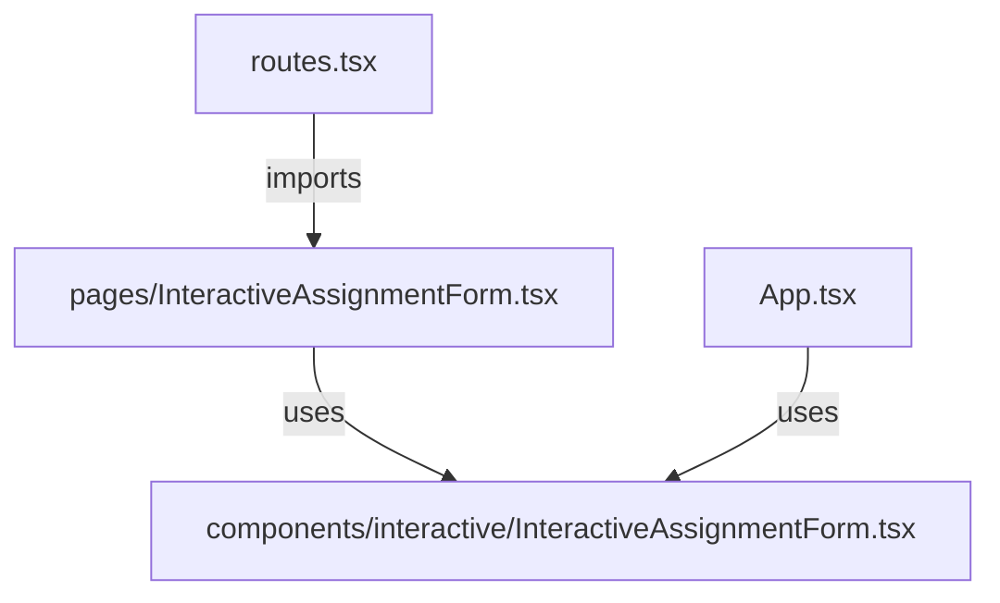
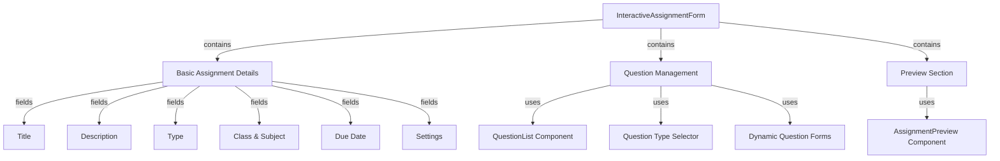

# Interactive Assignment Form Fix Plan

## Issue Summary

The "Create Assignment" button on http://localhost:3000/interactive-assignments/create is not working. When clicked, nothing happens. After investigating the codebase, two main issues were identified:

1. **Incomplete Form Component**: The `InteractiveAssignmentForm.tsx` component has a schema defined but the actual form fields are missing. There's a TODO comment that says "TODO: Add form fields based on schema".

2. **Routing Issue**: There's a discrepancy between how the component is imported:
   - In `routes.tsx`: It imports from `'./pages/InteractiveAssignmentForm'` which doesn't exist
   - In `App.tsx`: It correctly imports from `'@/components/interactive/InteractiveAssignmentForm'`

## Implementation Plan

### 1. Fix the Routing Issue

Create a proper page component in the pages directory that uses the form component:



#### Steps:

1. Create a new file `src/pages/InteractiveAssignmentForm.tsx`
2. Implement a simple page component that imports and uses the form component
3. Add navigation handling for form submission and cancellation

```typescript
// src/pages/InteractiveAssignmentForm.tsx
import { useNavigate, useParams } from 'react-router-dom';
import { InteractiveAssignmentForm } from '@/components/interactive/InteractiveAssignmentForm';
import { interactiveAssignmentService } from '@/services/interactiveAssignmentService';
import { useEffect, useState } from 'react';
import { LoadingSpinner } from '@/components/ui/loading-spinner';
import { toast } from 'react-hot-toast';

export default function InteractiveAssignmentFormPage() {
  const navigate = useNavigate();
  const { id } = useParams();
  const [initialData, setInitialData] = useState(null);
  const [loading, setLoading] = useState(!!id);

  useEffect(() => {
    if (id) {
      const fetchAssignment = async () => {
        try {
          const data = await interactiveAssignmentService.getById(id);
          setInitialData(data);
        } catch (error) {
          toast.error('Failed to load assignment');
          console.error(error);
        } finally {
          setLoading(false);
        }
      };
      fetchAssignment();
    }
  }, [id]);

  const handleSubmit = async (data) => {
    try {
      if (id) {
        await interactiveAssignmentService.update(id, data);
        toast.success('Assignment updated successfully');
      } else {
        await interactiveAssignmentService.create(data);
        toast.success('Assignment created successfully');
      }
      navigate('/interactive-assignments');
    } catch (error) {
      toast.error('Failed to save assignment');
      console.error(error);
    }
  };

  const handleCancel = () => {
    navigate('/interactive-assignments');
  };

  if (loading) {
    return <LoadingSpinner />;
  }

  return (
    <div className="container mx-auto py-8">
      <InteractiveAssignmentForm
        initialData={initialData}
        onSubmit={handleSubmit}
        onCancel={handleCancel}
      />
    </div>
  );
}
```

### 2. Complete the Form Component

Implement the missing form fields based on the schema in the `InteractiveAssignmentForm` component:

#### Steps:

1. Add basic assignment details fields (title, description, type, etc.)
2. Implement question management with the existing QuestionList component
3. Add question type selection and dynamic form rendering
4. Integrate the AssignmentPreview component for real-time preview



### 3. Implement Form Fields

Replace the TODO comment with actual form fields based on the schema:

```typescript
{/* Basic Assignment Details */}
<Card className="mb-6">
  <CardHeader>
    <CardTitle>Basic Details</CardTitle>
  </CardHeader>
  <CardContent className="space-y-4">
    <FormField
      control={form.control}
      name="title"
      render={({ field }) => (
        <FormItem>
          <FormLabel>Title</FormLabel>
          <FormControl>
            <Input placeholder="Assignment title" {...field} />
          </FormControl>
          <FormMessage />
        </FormItem>
      )}
    />
    
    <FormField
      control={form.control}
      name="description"
      render={({ field }) => (
        <FormItem>
          <FormLabel>Description</FormLabel>
          <FormControl>
            <Textarea 
              placeholder="Provide a description of the assignment" 
              {...field} 
            />
          </FormControl>
          <FormMessage />
        </FormItem>
      )}
    />
    
    <div className="grid grid-cols-1 md:grid-cols-2 gap-4">
      <FormField
        control={form.control}
        name="type"
        render={({ field }) => (
          <FormItem>
            <FormLabel>Assignment Type</FormLabel>
            <Select 
              onValueChange={field.onChange} 
              defaultValue={field.value}
            >
              <FormControl>
                <SelectTrigger>
                  <SelectValue placeholder="Select type" />
                </SelectTrigger>
              </FormControl>
              <SelectContent>
                <SelectItem value="MATCHING">Matching</SelectItem>
                <SelectItem value="COMPLETION">Completion</SelectItem>
                <SelectItem value="DRAWING">Drawing</SelectItem>
                <SelectItem value="MULTIPLE_CHOICE">Multiple Choice</SelectItem>
                <SelectItem value="ORDERING">Ordering</SelectItem>
                <SelectItem value="SORTING">Sorting</SelectItem>
                <SelectItem value="PUZZLE">Puzzle</SelectItem>
                <SelectItem value="IDENTIFICATION">Identification</SelectItem>
                <SelectItem value="COUNTING">Counting</SelectItem>
                <SelectItem value="TRACING">Tracing</SelectItem>
                <SelectItem value="AUDIO_READING">Audio Reading</SelectItem>
              </SelectContent>
            </Select>
            <FormMessage />
          </FormItem>
        )}
      />
      
      <FormField
        control={form.control}
        name="difficultyLevel"
        render={({ field }) => (
          <FormItem>
            <FormLabel>Difficulty Level</FormLabel>
            <Select 
              onValueChange={field.onChange} 
              defaultValue={field.value}
            >
              <FormControl>
                <SelectTrigger>
                  <SelectValue placeholder="Select difficulty" />
                </SelectTrigger>
              </FormControl>
              <SelectContent>
                <SelectItem value="beginner">Beginner</SelectItem>
                <SelectItem value="intermediate">Intermediate</SelectItem>
                <SelectItem value="advanced">Advanced</SelectItem>
              </SelectContent>
            </Select>
            <FormMessage />
          </FormItem>
        )}
      />
    </div>
    
    <div className="grid grid-cols-1 md:grid-cols-2 gap-4">
      <FormField
        control={form.control}
        name="classId"
        render={({ field }) => (
          <FormItem>
            <FormLabel>Class</FormLabel>
            <Select 
              onValueChange={field.onChange} 
              defaultValue={field.value}
            >
              <FormControl>
                <SelectTrigger>
                  <SelectValue placeholder="Select class" />
                </SelectTrigger>
              </FormControl>
              <SelectContent>
                {/* Fetch and map classes here */}
                <SelectItem value="class1">Class 1</SelectItem>
                <SelectItem value="class2">Class 2</SelectItem>
              </SelectContent>
            </Select>
            <FormMessage />
          </FormItem>
        )}
      />
      
      <FormField
        control={form.control}
        name="subjectId"
        render={({ field }) => (
          <FormItem>
            <FormLabel>Subject</FormLabel>
            <Select 
              onValueChange={field.onChange} 
              defaultValue={field.value}
            >
              <FormControl>
                <SelectTrigger>
                  <SelectValue placeholder="Select subject" />
                </SelectTrigger>
              </FormControl>
              <SelectContent>
                {/* Fetch and map subjects here */}
                <SelectItem value="subject1">English</SelectItem>
                <SelectItem value="subject2">Mathematics</SelectItem>
              </SelectContent>
            </Select>
            <FormMessage />
          </FormItem>
        )}
      />
    </div>
    
    <FormField
      control={form.control}
      name="dueDate"
      render={({ field }) => (
        <FormItem className="flex flex-col">
          <FormLabel>Due Date</FormLabel>
          <Popover>
            <PopoverTrigger asChild>
              <FormControl>
                <Button
                  variant={"outline"}
                  className={cn(
                    "w-full pl-3 text-left font-normal",
                    !field.value && "text-muted-foreground"
                  )}
                >
                  {field.value ? (
                    format(field.value, "PPP")
                  ) : (
                    <span>Pick a date</span>
                  )}
                  <CalendarIcon className="ml-auto h-4 w-4 opacity-50" />
                </Button>
              </FormControl>
            </PopoverTrigger>
            <PopoverContent className="w-auto p-0" align="start">
              <Calendar
                mode="single"
                selected={field.value}
                onSelect={field.onChange}
                disabled={(date) => date < new Date()}
                initialFocus
              />
            </PopoverContent>
          </Popover>
          <FormMessage />
        </FormItem>
      )}
    />
    
    <FormField
      control={form.control}
      name="estimatedTimeMinutes"
      render={({ field }) => (
        <FormItem>
          <FormLabel>Estimated Time (minutes)</FormLabel>
          <FormControl>
            <Input 
              type="number" 
              {...field} 
              onChange={(e) => field.onChange(parseInt(e.target.value))}
            />
          </FormControl>
          <FormMessage />
        </FormItem>
      )}
    />
    
    <div className="grid grid-cols-1 md:grid-cols-3 gap-4">
      <FormField
        control={form.control}
        name="hasAudioFeedback"
        render={({ field }) => (
          <FormItem className="flex flex-row items-center justify-between rounded-lg border p-3">
            <div className="space-y-0.5">
              <FormLabel>Audio Feedback</FormLabel>
              <FormDescription>
                Enable audio feedback for students
              </FormDescription>
            </div>
            <FormControl>
              <Switch
                checked={field.value}
                onCheckedChange={field.onChange}
              />
            </FormControl>
          </FormItem>
        )}
      />
      
      <FormField
        control={form.control}
        name="hasCelebration"
        render={({ field }) => (
          <FormItem className="flex flex-row items-center justify-between rounded-lg border p-3">
            <div className="space-y-0.5">
              <FormLabel>Celebration</FormLabel>
              <FormDescription>
                Show celebration on completion
              </FormDescription>
            </div>
            <FormControl>
              <Switch
                checked={field.value}
                onCheckedChange={field.onChange}
              />
            </FormControl>
          </FormItem>
        )}
      />
      
      <FormField
        control={form.control}
        name="requiresParentHelp"
        render={({ field }) => (
          <FormItem className="flex flex-row items-center justify-between rounded-lg border p-3">
            <div className="space-y-0.5">
              <FormLabel>Parent Help</FormLabel>
              <FormDescription>
                Requires parent assistance
              </FormDescription>
            </div>
            <FormControl>
              <Switch
                checked={field.value}
                onCheckedChange={field.onChange}
              />
            </FormControl>
          </FormItem>
        )}
      />
    </div>
  </CardContent>
</Card>
```

### 4. Implement Question Management

Add question management functionality to the form:

```typescript
{/* Question Management */}
<Card className="mb-6">
  <CardHeader className="flex flex-row items-center justify-between">
    <CardTitle>Questions</CardTitle>
    <Button 
      type="button" 
      onClick={() => setShowQuestionForm(true)}
      disabled={showQuestionForm}
    >
      <Plus className="mr-2 h-4 w-4" />
      Add Question
    </Button>
  </CardHeader>
  <CardContent>
    {questions.length === 0 ? (
      <div className="text-center py-6 text-gray-500">
        No questions added yet. Click "Add Question" to create your first question.
      </div>
    ) : (
      <QuestionList
        questions={questions}
        onReorder={handleReorderQuestions}
        onEdit={handleEditQuestion}
        onDelete={handleDeleteQuestion}
      />
    )}
    
    {showQuestionForm && (
      <div className="mt-4 border rounded-lg p-4">
        <h3 className="text-lg font-medium mb-4">
          {editingQuestionIndex !== null ? 'Edit Question' : 'Add New Question'}
        </h3>
        
        <div className="mb-4">
          <label className="block text-sm font-medium mb-1">Question Type</label>
          <Select 
            value={currentQuestionType} 
            onValueChange={setCurrentQuestionType}
          >
            <SelectTrigger>
              <SelectValue placeholder="Select question type" />
            </SelectTrigger>
            <SelectContent>
              <SelectItem value="MATCHING">Matching</SelectItem>
              <SelectItem value="COMPLETION">Completion</SelectItem>
              <SelectItem value="MULTIPLE_CHOICE">Multiple Choice</SelectItem>
              <SelectItem value="ORDERING">Ordering</SelectItem>
              <SelectItem value="DRAWING">Drawing</SelectItem>
              <SelectItem value="TRACING">Tracing</SelectItem>
              {/* Add other question types */}
            </SelectContent>
          </Select>
        </div>
        
        {/* Render the appropriate question form based on type */}
        {currentQuestionType === 'MATCHING' && (
          <MatchingQuestionForm
            initialData={editingQuestionIndex !== null ? questions[editingQuestionIndex] : undefined}
            onSubmit={handleQuestionSubmit}
            onCancel={() => {
              setShowQuestionForm(false);
              setEditingQuestionIndex(null);
            }}
          />
        )}
        {/* Add other question type forms */}
      </div>
    )}
  </CardContent>
</Card>
```

### 5. Add Preview Section

Implement the preview section using the AssignmentPreview component:

```typescript
{/* Preview Section */}
<Card className="mb-6">
  <CardHeader className="flex flex-row items-center justify-between">
    <CardTitle>Preview</CardTitle>
    <Button 
      type="button" 
      variant="outline" 
      onClick={() => setShowPreview(!showPreview)}
    >
      {showPreview ? 'Hide Preview' : 'Show Preview'}
    </Button>
  </CardHeader>
  <CardContent>
    {showPreview ? (
      <AssignmentPreview
        assignment={{
          ...form.getValues(),
          questions: questions
        }}
        onClose={() => setShowPreview(false)}
      />
    ) : (
      <div className="text-center py-6 text-gray-500">
        Click "Show Preview" to see how your assignment will appear to students.
      </div>
    )}
  </CardContent>
</Card>
```

### 6. Fix Form Submission

Update the form submission logic to handle questions and properly submit the data:

```typescript
async function onFormSubmit(data: FormValues) {
  try {
    setIsSubmitting(true);
    
    // Combine form data with questions
    const formData = {
      ...data,
      questions: questions
    };
    
    // Submit the data
    if (onSubmit) {
      await onSubmit(formData);
    } else {
      // Default submission if no onSubmit prop is provided
      const result = await interactiveAssignmentService.create(formData);
      toast.success("Assignment created successfully");
      // Navigate to the assignments list
      navigate('/interactive-assignments');
    }
  } catch (error) {
    console.error('Error submitting form:', error);
    toast.error("Failed to submit form");
  } finally {
    setIsSubmitting(false);
  }
}
```

### 7. Testing Plan

After implementing the changes, test the form functionality:

1. **Navigation Test**:
   - Click the "Create Assignment" button on the interactive assignments page
   - Verify that it navigates to the form page

2. **Form Fields Test**:
   - Verify all form fields are displayed correctly
   - Test validation by submitting with empty required fields
   - Test each field with valid and invalid inputs

3. **Question Management Test**:
   - Add different types of questions
   - Edit existing questions
   - Delete questions
   - Reorder questions using drag and drop

4. **Preview Test**:
   - Toggle the preview to show/hide
   - Verify the preview displays the current form data correctly
   - Test the preview in both desktop and mobile views

5. **Submission Test**:
   - Submit a complete form
   - Verify the data is saved correctly
   - Verify navigation after submission

## Conclusion

This plan addresses both the routing issue and the incomplete form component. By implementing these changes, the "Create Assignment" button should work correctly, and users should be able to create interactive assignments with various question types.