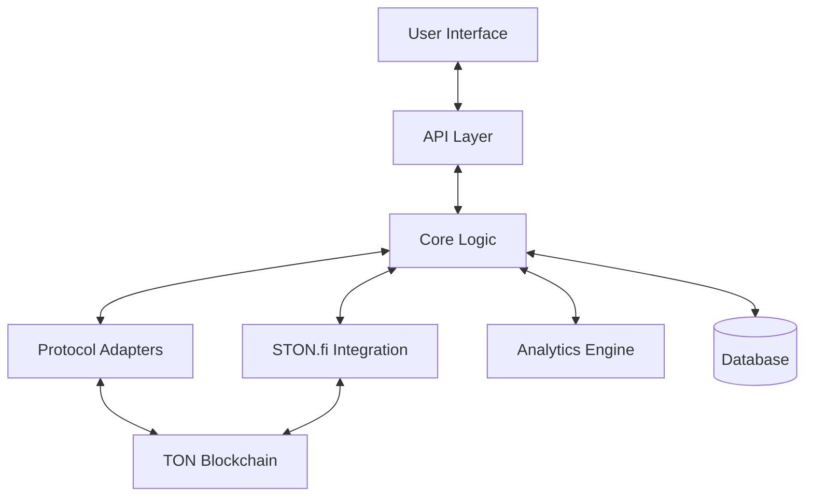
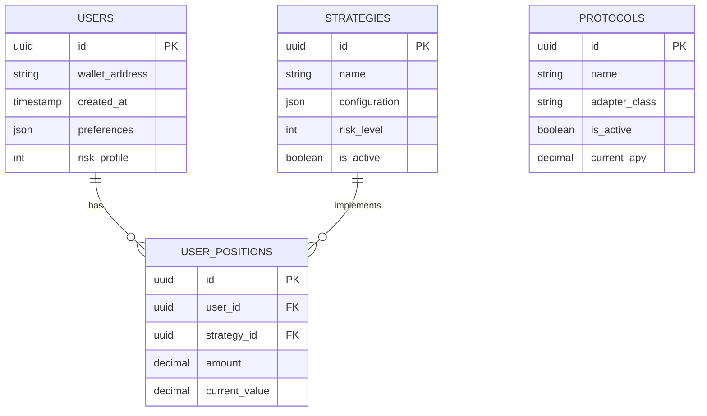

# Technical Specification: DeFi Yield Aggregator with STON.fi Integration

## 1. System Overview

### 1.1 Project Description
The DeFi Yield Aggregator is a platform that automatically optimizes users' cryptocurrency holdings across various yield-generating protocols on The Open Network (TON) blockchain, with plans to expand to other blockchains. The system leverages STON.fi's gasless swap functionality to efficiently move funds between different protocols to maximize returns while minimizing transaction costs.

### 1.2 Core Features
- Automated yield optimization across multiple protocols
- Gasless token swaps via STON.fi integration
- Risk-adjusted strategy selection
- Cross-chain yield opportunities (future expansion)
- User dashboard for deposits, withdrawals, and performance tracking
- Strategy customization options

### 1.3 System Architecture Overview



## 2. Technical Architecture

### 2.1 Frontend Architecture

#### 2.1.1 Technology Stack
- **Framework**: React with TypeScript
- **State Management**: Redux Toolkit
- **Styling**: Tailwind CSS
- **Web3 Integration**: TON Connect
- **Data Fetching**: React Query
- **Build Tool**: Vite

#### 2.1.2 Key Components

```typescript
// Component structure
interface ComponentStructure {
  pages: {
    Dashboard: React.FC;
    Deposit: React.FC;
    Withdraw: React.FC;
    Strategies: React.FC;
    Analytics: React.FC;
    Settings: React.FC;
  };
  components: {
    common: {
      Header: React.FC;
      Footer: React.FC;
      Sidebar: React.FC;
      Button: React.FC<ButtonProps>;
      Modal: React.FC<ModalProps>;
    };
    dashboard: {
      PortfolioSummary: React.FC;
      YieldComparison: React.FC;
      RecentTransactions: React.FC;
      PerformanceChart: React.FC;
    };
  };
}
```

### 2.2 Backend Architecture

#### 2.2.1 Technology Stack
- **Runtime**: Node.js with TypeScript
- **API Framework**: Express.js
- **Database**: PostgreSQL with TypeORM
- **Caching**: Redis
- **Task Scheduling**: Bull
- **Monitoring**: Prometheus + Grafana
- **Containerization**: Docker + Kubernetes

#### 2.2.2 Database Schema



## 3. STON.fi Integration

### 3.1 Integration Points

#### 3.1.1 STON.fi SDK Setup

```typescript
// src/services/stonfi/client.ts
import { StonFiSDK, NetworkType } from 'ston-fi-sdk';
import { config } from '../../config';

export class StonFiClient {
  private static instance: StonFiClient;
  private sdk: StonFiSDK;
  
  private constructor() {
    this.sdk = new StonFiSDK({
      projectId: config.stonFi.projectId,
      apiKey: config.stonFi.apiKey,
      network: config.environment === 'production' 
        ? NetworkType.MAINNET 
        : NetworkType.TESTNET
    });
  }
  
  public static getInstance(): StonFiClient {
    if (!StonFiClient.instance) {
      StonFiClient.instance = new StonFiClient();
    }
    return StonFiClient.instance;
  }
  
  public getSdk(): StonFiSDK {
    return this.sdk;
  }
}
```

#### 3.1.2 Token Swap Service

```typescript
// src/services/stonfi/swap-service.ts
import { StonFiClient } from './client';
import { TokenAmount, SwapParams, SwapResult } from '../../types/stonfi';
import { logger } from '../../utils/logger';

export class SwapService {
  private client = StonFiClient.getInstance().getSdk();
  
  /**
   * Execute a gasless token swap through STON.fi
   */
  public async executeSwap(params: SwapParams): Promise<SwapResult> {
    try {
      logger.info(`Executing swap: ${params.fromToken} -> ${params.toToken}`);
      
      const result = await this.client.swap({
        fromToken: params.fromToken,
        toToken: params.toToken,
        amount: params.amount.toString(),
        slippageTolerance: params.slippageTolerance || 0.5,
        walletAddress: params.walletAddress,
        deadline: Math.floor(Date.now() / 1000) + 3600 // 1 hour from now
      });
      
      return {
        txHash: result.txHash,
        fromAmount: params.amount,
        toAmount: result.receivedAmount,
        executionPrice: result.executionPrice,
        timestamp: Date.now()
      };
    } catch (error) {
      logger.error(`Swap failed: ${error.message}`);
      throw new Error(`Failed to execute swap: ${error.message}`);
    }
  }
}
```

### 3.2 Protocol Adapter System

```typescript
// src/services/protocols/protocol-adapter.interface.ts
export interface ProtocolAdapter {
  readonly protocolId: string;
  readonly protocolName: string;
  
  // Core functionality
  deposit(token: string, amount: number, userAddress: string): Promise<TransactionResult>;
  withdraw(token: string, amount: number, userAddress: string): Promise<TransactionResult>;
  getBalance(token: string, userAddress: string): Promise<TokenAmount>;
  
  // Yield information
  getCurrentYield(token: string): Promise<YieldInfo>;
  
  // Risk assessment
  getRiskScore(): Promise<number>; // 1-10 scale
  getProtocolTVL(): Promise<number>;
}
```

## 4. Yield Optimization Engine

### 4.1 Strategy Definition

```typescript
// src/types/strategy.ts
export interface YieldStrategy {
  id: string;
  name: string;
  description: string;
  riskLevel: number; // 1-10 scale
  expectedApy: number;
  protocols: {
    protocolId: string;
    allocation: number; // Percentage (0-100)
    token: string;
  }[];
  isActive: boolean;
  minimumInvestment: number;
  tags: string[];
  createdAt: Date;
  updatedAt: Date;
}
```

### 4.2 Yield Optimizer Service

```typescript
// src/services/yield/optimizer-service.ts
import { ProtocolRegistry } from '../protocols/protocol-registry';
import { SwapService } from '../stonfi/swap-service';
import { YieldStrategy, OptimizationResult } from '../../types/strategy';
import { TokenAmount, ProtocolYield } from '../../types/common';
import { logger } from '../../utils/logger';

export class YieldOptimizerService {
  private protocolRegistry: ProtocolRegistry;
  private swapService: SwapService;
  
  constructor() {
    this.protocolRegistry = new ProtocolRegistry();
    this.swapService = new SwapService();
  }
  
  /**
   * Find the optimal yield strategy based on user preferences
   */
  public async findOptimalStrategy(
    amount: number,
    token: string,
    riskTolerance: number,
    userAddress: string
  ): Promise<OptimizationResult> {
    try {
      // Get all active protocols
      const protocols = await this.protocolRegistry.getActiveProtocols();
      
      // Get current yields for all protocols
      const yields: ProtocolYield[] = await Promise.all(
        protocols.map(async (protocol) => {
          const adapter = this.protocolRegistry.getAdapter(protocol.id);
          const yieldInfo = await adapter.getCurrentYield(token);
          const riskScore = await adapter.getRiskScore();
          
          return {
            protocolId: protocol.id,
            protocolName: protocol.name,
            apy: yieldInfo.apy,
            riskScore,
            token
          };
        })
      );
      
      // Filter by risk tolerance and sort by APY
      const eligibleYields = yields
        .filter(y => y.riskScore <= riskTolerance)
        .sort((a, b) => b.apy - a.apy);
      
      // Create allocation strategy (simplified)
      const allocations = eligibleYields.slice(0, 3).map((yieldInfo, index) => {
        let allocation = index === 0 ? 60 : index === 1 ? 30 : 10;
        
        return {
          protocolId: yieldInfo.protocolId,
          allocation,
          token
        };
      });
      
      // Calculate expected APY
      const expectedApy = allocations.reduce((total, allocation) => {
        const yieldInfo = eligibleYields.find(y => y.protocolId === allocation.protocolId);
        return total + (yieldInfo.apy * (allocation.allocation / 100));
      }, 0);
      
      // Create strategy
      const strategy: YieldStrategy = {
        id: `strategy-${Date.now()}`,
        name: `Optimized Strategy (${riskTolerance}/10 Risk)`,
        description: `Automatically generated strategy with ${riskTolerance}/10 risk tolerance`,
        riskLevel: Math.max(...allocations.map(a => {
          const yieldInfo = eligibleYields.find(y => y.protocolId === a.protocolId);
          return yieldInfo.riskScore;
        })),
        expectedApy,
        protocols: allocations,
        isActive: true,
        minimumInvestment: 10,
        tags: ['automated', `risk-${riskTolerance}`],
        createdAt: new Date(),
        updatedAt: new Date()
      };
      
      return {
        strategy,
        expectedAnnualYield: amount * (expectedApy / 100),
        estimatedGasSavings: this.calculateGasSavings(allocations.length),
        recommendedRebalanceFrequency: this.getRecommendedRebalanceFrequency(expectedApy)
      };
    } catch (error) {
      logger.error(`Failed to find optimal strategy: ${error.message}`);
      throw new Error(`Failed to find optimal strategy: ${error.message}`);
    }
  }
  
  /**
   * Execute a strategy by depositing funds into multiple protocols
   */
  public async executeStrategy(
    strategy: YieldStrategy,
    amount: number,
    token: string,
    userAddress: string
  ): Promise<boolean> {
    try {
      // For each protocol in the strategy
      for (const protocolAllocation of strategy.protocols) {
        const allocationAmount = amount * (protocolAllocation.allocation / 100);
        const adapter = this.protocolRegistry.getAdapter(protocolAllocation.protocolId);
        
        // If token doesn't match, swap first
        if (token !== protocolAllocation.token) {
          const swapResult = await this.swapService.executeSwap({
            fromToken: token,
            toToken: protocolAllocation.token,
            amount: allocationAmount,
            walletAddress: userAddress
          });
          
          // Deposit swapped tokens
          await adapter.deposit(
            protocolAllocation.token,
            parseFloat(swapResult.toAmount.toString()),
            userAddress
          );
        } else {
          // Deposit directly
          await adapter.deposit(
            token,
            allocationAmount,
            userAddress
          );
        }
      }
      
      return true;
    } catch (error) {
      logger.error(`Failed to execute strategy: ${error.message}`);
      throw new Error(`Failed to execute strategy: ${error.message}`);
    }
  }
  
  /**
   * Calculate estimated gas savings from using STON.fi
   */
  private calculateGasSavings(numTransactions: number): number {
    const avgGasCostPerTx = 0.05; // in TON
    return avgGasCostPerTx * numTransactions;
  }
  
  /**
   * Get recommended rebalance frequency based on APY
   */
  private getRecommendedRebalanceFrequency(apy: number): string {
    if (apy > 50) return 'daily';
    else if (apy > 20) return 'weekly';
    else return 'monthly';
  }
}
```

## 5. Implementation Roadmap

### Phase 1: Core Infrastructure (Weeks 1-4)
- Set up development environment
- Implement STON.fi SDK integration
- Create basic protocol adapters
- Develop core database schema

### Phase 2: Yield Optimization Engine (Weeks 5-8)
- Implement yield optimization algorithms
- Develop risk scoring system
- Create strategy execution engine
- Build rebalancing mechanism

### Phase 3: User Interface (Weeks 9-12)
- Develop dashboard UI
- Implement deposit/withdraw flows
- Create strategy visualization components
- Build analytics and reporting features

### Phase 4: Testing & Deployment (Weeks 13-16)
- Comprehensive testing on testnet
- Security audit
- Performance optimization
- Mainnet deployment

## 6. Scaling Considerations

### 6.1 Technical Scaling
- Implement sharding for database as user base grows
- Add caching layers for frequently accessed data
- Optimize smart contracts for gas efficiency
- Implement rate limiting and request queuing

### 6.2 Business Scaling
- Add support for additional TON protocols
- Expand to other blockchains via bridges
- Introduce premium features for power users
- Develop institutional-grade offerings

### 6.3 Cross-Chain Expansion
- Integrate with Ethereum via TON Bridge
- Add support for Solana ecosystem
- Implement cross-chain yield opportunities
- Develop unified liquidity management across chains
